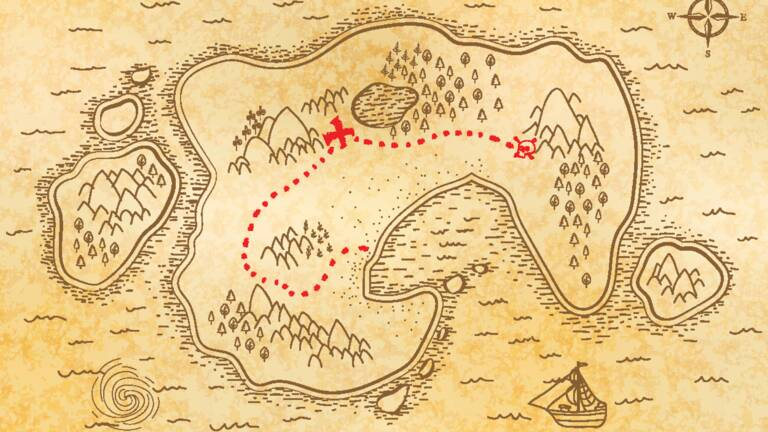

<!-- Improved compatibility of back to top link: See: https://github.com/othneildrew/Best-README-Template/pull/73 -->
<a name="readme-top"></a>
<!--
*** Thanks for checking out the Best-README-Template. If you have a suggestion
*** that would make this better, please fork the repo and create a pull request
*** or simply open an issue with the tag "enhancement".
*** Don't forget to give the project a star!
*** Thanks again! Now go create something AMAZING! :D
-->


<!-- PROJECT SHIELDS -->
<!--
*** I'm using markdown "reference style" links for readability.
*** Reference links are enclosed in brackets [ ] instead of parentheses ( ).
*** See the bottom of this document for the declaration of the reference variables
*** for contributors-url, forks-url, etc. This is an optional, concise syntax you may use.
*** https://www.markdownguide.org/basic-syntax/#reference-style-links
-->
[![LinkedIn][linkedin-shield]][linkedin-url]


<!-- PROJECT LOGO -->
<br />
<div align="center">
  <a href="https://github.com/billyfr/carbonIt_test">
    
  </a>

<h3 align="center">La carte aux trésors</h3>

  <p align="center">
    Guidez les aventuriers en quête de trésors !
    <br />
    <a href="https://github.com/billyfr/carbonIt_test"><strong>Explore the docs »</strong></a>
  </p>
</div>


<!-- TABLE OF CONTENTS -->
<details>
  <summary>Table of Contents</summary>
  <ol>
    <li>
      <a href="#about-the-project">Context</a>
      <ul>
        <li><a href="#built-with">Built With</a></li>
      </ul>
    </li>
    <li>
      <a href="#getting-started">Getting Started</a>
      <ul>
        <li><a href="#prerequisites">Prerequisites</a></li>
        <li><a href="#installation">Installation</a></li>
      </ul>
    </li>
    <li><a href="#usage">Usage</a></li>
    <li><a href="#roadmap">Roadmap</a></li>
    <li><a href="#contributing">Contributing</a></li>
    <li><a href="#license">License</a></li>
    <li><a href="#contact">Contact</a></li>
    <li><a href="#acknowledgments">Acknowledgments</a></li>
  </ol>
</details>


<!-- ABOUT THE PROJECT -->
## Context

Le gouvernement péruvien vient d’autoriser les aventuriers en quête de trésors à explorer les 85 182
km2 du département de la Madre de Dios. Vous devez réaliser un système permettant de suivre les
déplacements et les collectes de trésors effectuées par les aventuriers. Le gouvernement péruvien
étant très à cheval sur les bonnes pratiques de code, il est important de réaliser un code de qualité,
lisible, et maintenable (oui, ça veut dire avec des tests) !

<p align="right">(<a href="#readme-top">back to top</a>)</p>


### Built With

* [![C#][Net]][Net-Url]

<p align="right">(<a href="#readme-top">back to top</a>)</p>


<!-- GETTING STARTED -->
## Getting Started


### Prerequisites

Vous devez installer .net 5 https://dotnet.microsoft.com/en-us/download/dotnet/5.0

### Installation

1. Clone the repo
   ```sh
   git clone https://github.com/billyfr/carbonIt_test.git
   ```
2. Go to Game dir
   ```sh
   cd Game
   ```
4. Run command
   ```sh
    dotnet run <path/file>
   ```

### Run Test

1. Go to Game dir
   ```sh
   cd Unit-test
   ```
4. Run command
   ```sh
    dotnet test
   ```

<p align="right">(<a href="#readme-top">back to top</a>)</p>

<!-- CONTACT -->
## Contact

Project Link: [https://github.com/billyfr/carbonIt_test](https://github.com/billyfr/carbonIt_test)

<p align="right">(<a href="#readme-top">back to top</a>)</p>

<!-- MARKDOWN LINKS & IMAGES -->
<!-- https://www.markdownguide.org/basic-syntax/#reference-style-links -->
[contributors-shield]: https://img.shields.io/github/contributors/billyfr/carbonIt_test.svg?style=for-the-badge
[contributors-url]: https://github.com/billyfr/carbonIt_test/graphs/contributors
[linkedin-shield]: https://img.shields.io/badge/-LinkedIn-black.svg?style=for-the-badge&logo=linkedin&colorB=555
[linkedin-url]: https://www.linkedin.com/in/billy-prak-a045b8109/
[Net]: https://camo.githubusercontent.com/3feee536f05c1904d434b6a3c964012efbcf807410421bd64744441247ac1a73/68747470733a2f2f696d672e736869656c64732e696f2f62616467652f56657273696f6e2d6e6574352e302d627269676874677265656e3f6c6f676f3d637368617270
[Net-Url]: https://dotnet.microsoft.com/en-us/download/dotnet/5.0
